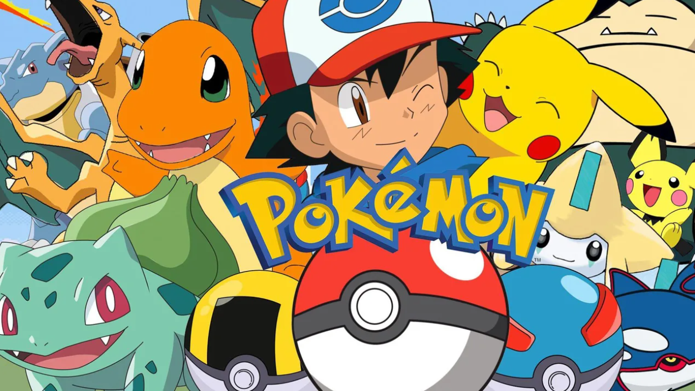

# Pokemon game.

### In this project we will represent a Pokemon game that works automatically.
----

In each scenario we choose in the game a display system will open that will display a graph.
On the map it will be possible to see the Pokemon trainers moving on the sides of the graph and trying to catch as many Pokemon as possible.
The Pokemon can also be seen on the ribs
Trainers speed changes as they catch more Pokemon.
Each Pokemon has a different score,
When a trainer captures a Pokemon he gets the score of that Pokemon.

-------------------------------------------------------------------------------------

The Pokemon trainers are programmed so that they will always want to catch the Pokemon with the shortest path from their point,
Various algorithms are used for this purpose.
These algorithms work on graphs so we are guaranteed that the trainers will always want to get to Pokemon with the shortest path -see https://github.com/georgekouzi/pokemon_Game/wiki/graph-algorithm-class.

-------------------------------------------------------------------------------------

#### How It Works:

1) You have 24 scenario games (Between 0 and 23), each scenario different.
   The difference is:
* Each stage has its own map.
* The amount of Pokemon trainers varies from scenario to scenario.
* The amount of Pokemon to catch varies from scenario to scenario.

2) Once you have chosen which scenario you want to play you need to put our id. 
then the game will start running with a time limit - each Scenario has its own limit time .

3) when the game start you can see the results that each agent has accumulated and his transitions from node to node.

## Another explanation for how the game work : 
https://github.com/georgekouzi/pokemon_Game/wiki/pokemon-game

## for more informetion about the projact : 
https://github.com/georgekouzi/pokemon_Game/wiki.

----

#### The project was written by Dolev Saadia and George Kouzi:

https://github.com/georgekouzi

https://github.com/dolevsaadia

----

